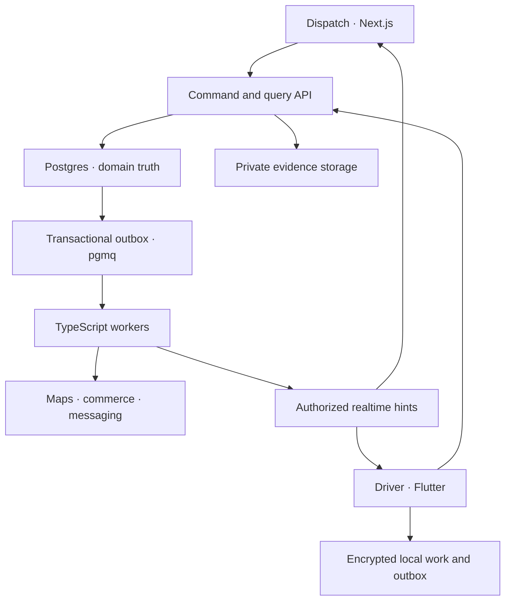

# E01 — Architecture and Deployment

Rounds engineering specification · Consolidated V2.3 · 8 September 2026

## Retained stack and decisions

The original Engineering Architecture v1.1 selects Supabase PostgreSQL/PostGIS, Auth, private Storage, Broadcast realtime and pgmq/Cron; Next.js/React/TypeScript Operations; TypeScript command API and worker on ECS/Fargate in Singapore; Flutter/Dart Driver with native Swift/Kotlin escape hatch and embedded Google Navigation subject to field gate. Retain this direction. This is Rounds, not a transplant of Magellan's separate infrastructure. No NestJS framework requirement is inferred from another product; API framework can be chosen within TypeScript without changing contracts.

Use a modular monolith for transactional domains, with two long-lived services (API and worker), not one microservice per table. API handles commands/queries/authenticated location ingest and provider ingress; worker handles durable deferred effects. At least two worker tasks in production preserve availability. Proposed two API tasks behind load balancer is the baseline; exact sizing is measured. No Kafka/Redis/Kubernetes requirement before evidence warrants it.

## Topology

Database, API and workers are located in/near Singapore. Frontend delivery may use Vercel; data-touching functions must execute near the data plane rather than accidentally using another region. Avoid unnecessary SSR proxy hops: web sends consequential commands to the API. Staging/prod use separate Supabase projects, secrets, buckets, provider credentials and push destinations. Demo data is unmistakably separate and cannot send real customer messages.

## Module boundaries

Identity/tenancy owns grants; configuration/calendar owns policy/slot/shift resolution; intake owns drafts/source dedupe; planning owns proposals/releases; execution owns attempts/manifests/custody/proof; Network owns offers/agreements; Intercity owns trips/receipts; comms owns threads/calls; integrations own provider receipt/writeback; ledger owns finance facts; telemetry owns raw/hot location; history projects authoritative events. Cross-module mutation executes through the common transaction service; no independent parallel writes to shared custody.

External adapters are routing/matrix, geocoding/AI extraction, navigation, commerce, email/SMS/LINE, push and optional voice. Lalamove is deferred and absent from active dependency graph. Provider key/configuration never defines domain state. Provider calls occur outside database transaction with durable intent/receipt so timeout-after-success is reconcilable.

## Client responsibilities

Web displays scoped projections, allows draft planning and proposes commands. It cannot write core tables directly. During primary outage it may show labelled cached read-only state, not act as a competing dispatcher database. Driver owns capture/UI/local outbox and safe navigation lifecycle; services own accepted work and durable evidence truth. Flutter and TypeScript share generated contract models, not UI code or separate business validators that can override server decisions.

## Repository and environments

Use apps/operations-web and apps/driver-app; services/api and services/worker; packages/contracts/domain/observability/config; supabase/migrations/tests; mocks/commerce/routing/messages/voice; specs/product/engineering/review. CI generates typed clients, checks schema drift and prevents secrets/sample success controls in production. Local reset seeds two tenants, multiple cities, Team/freelance, overnight slot, partial proof and transport discrepancy. Local mocks are explicit and cannot be confused with real billing/navigation.

## Field gate and architecture changes

Before promising embedded navigation, test one combined Flutter field harness with real navigation and Rounds location collection together: iPhone, mainstream Android and low-cost aggressive-background Android. Exercise background/foreground, screen lock, calls, permissions, auth loss, offline evidence, navigation resume and Thai guidance. If plugin fails but native SDK passes, keep Flutter with native bridge. Reopen framework choice only if evidence shows Flutter itself cannot meet requirements. Mapbox/server-provider coherence must be resolved before displaying provider-derived routes/addresses in production; E10 records current references.

## Operating gates

Do not equate deployed containers with ready delivery operations. Required gates: RLS/permissions and command concurrency; durable proof/outbox; real navigation/location on device; connector/provider ambiguity; localized UI; restore drill; observed latency/fanout/cost. Exact SDK/service versions and account quotas are pinned in implementation lockfiles/ADR after environment verification, not frozen from stale prototype notes.
