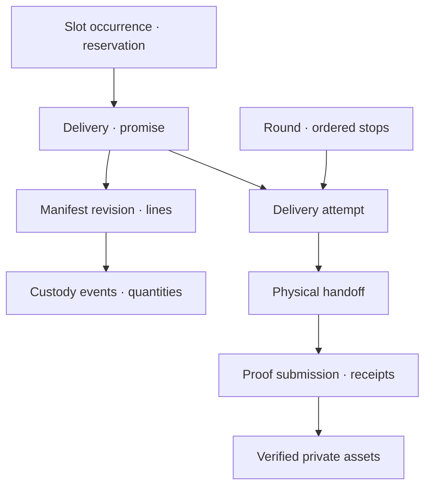

# E02 — Database Design and Invariants

Rounds engineering specification · Consolidated V2.3-r1 · 8 September 2026

## Changelog

- 2026-09-10 · v2.3-r1: isolated migration0010 adds immutable intake_address_reviews with same-draft input/output revision references, scoped city/actor insertion and no old-row backfill. Review revisions retain original submitted history and mark selected address provenance explicitly.
- 2026-09-10 · v2.3-r1: isolated migration0009 adds append-only manual intake_draft_revisions and city-scoped draft access, without backfilling old source/draft identity. ADR-T09 defines the adapter and upgrade acceptance.
- 2026-09-09 · v2.3-r1: ADR-T06 adds nullable proof note/location fields with immutable-content guards and narrowly scoped state-only own-team commitment release. Migration0005 is isolated; shared upgrade and phone mapping remain gated.
- 2026-09-08 · v2.3-r1: execute the full fresh PostGIS schema; fix trail-policy binding and missing-allocation/manifest-edit enforcement. Preserve separate migration, full-authorization and business-handler gates.

## Physical model and ownership

[Database dictionary](../database/DICTIONARY.md), [typed table catalogue](../database/TABLE-CATALOG.json) and [review DDL](../database/ROUNDS-REVIEW-SCHEMA.sql) define current domain tables/fields. Apply the base, V22 invariants, V23 complete-order guards and both role-policy files in [migration-boundary order](../database/MIGRATION-BOUNDARY.md). All131tables now install in an isolated PostgreSQL17.11/PostGIS3.5.6 fixture, with targeted restricted-role tests. This is not an upgrade of the shared database or acceptance of every command/policy. Actual authenticated command adapters and production migration remain implementation work.

Tenant objects carry tenant_id and composite uniqueness; same-tenant references use `(tenant_id, object_id)`. Global identity, device/availability and commitment/location infrastructure have separately restricted access. Round/Trip global references additionally bind tenant. Avoid JSON for relationship/custody identities. Snapshot/proposal/policy/source metadata may use JSON only with declared schema version and limits. Private photos/documents/audio live in private object storage, never byte blobs inside completion commands.

## Relational core

Delivery promises are immutable snapshots across template edits; attempts preserve retries. Stable stop IDs survive sequence change. Manifest seal prevents contents editing after pickup. Custody events are append-only facts and balances are rebuildable transactional projections. A foreign key only proves existence/same tenant, not that an asset belongs to the correct attempt, package to manifest or receiver to trip; command validation checks each relationship.

## Keys, types and constraints

Use UUID IDs and separate human delivery references. Money integer minor units plus ISO currency; quantities numeric(18,4) plus units/discrete validation. Timestamps are UTC instants with service date/timezone where business timing matters. Half-open busy ranges `[start,end)` allow one job ending exactly when another begins only if load/return/service time is already included. Validate finite nonempty ranges and earliest start after required travel. Driver exclusion constraint protects committed work across tenants; it does not remove the need for route/shift validation.

Core uniqueness: tenant/source connection/order; source event/provider key; slot template/version/date identity; active claim per fulfillment unit; agreement per broadcast; invitation hash; driver global identity; command scope/id; event aggregate version/type; message sender/client ID; provider event; consumer effect. Deferrable stop sequence uniqueness supports reorder inside one transaction. No cascade deletion for operational evidence. Index every RLS/filter/FK join and measured hot path; do not index all JSON blindly.

## Cross-row invariants

Slot holds and commits lock one occurrence/admission key and count unexpired holds + committed bookings. Materialization locks template/date to avoid duplicate capacity pools. Capacity edits below booked amount preserve commitments and mark overcommit. Transferring slot locks both in sorted order. Custody transaction locks manifest then line balances in sorted IDs; debits known source quantities and credits recorded receiver exactly once. Missing/unknown physical goods become discrepancy evidence, not negative balances or fake receiver.

Current whole-order allocation is checked at transaction end from every contributing table, not just allocation-row writes. Omitted lines, expected-quantity edits and current-manifest switches cannot commit an incomplete current unit; matching manifest/allocation revisions may commit atomically. These constraints supplement, not replace, the authenticated driver's physical collection checks.

Accepting a freelance offer locks broadcast/claims and global driver commitment; one agreement and converted claim set commit together. Release/transfer/change validates all expected aggregates and updates downstream ranges atomically. Evidence completion verifies asset owner/purpose/hash/receipt and policy version before success. Conditional unique/check constraints cannot express all these rules; implement TypeScript-owned transactions (ADR-T01) and test adversarial concurrency.

## Revision and deletion model

Mutable aggregate version increments once per consequential accepted command; immutable revisions/events retain their number and timestamps. The service sets updated_at/version; no client-writable audit columns. Command receipt and event/outbox commit in the same transaction. Soft archive affects new use, not references. Retention deletion/anonymization is a privileged reviewed job with holds and subject scope, not generic DELETE from UI. Personal data and operational integrity have separate retention classes.

## Time and partition design

Named slot offsets, recurrence, cutoffs and release are P03. Resolve named timezone with a versioned library and explicit DST invalid/ambiguous handling. Keep actual resolved instants; never recompute old promises from current tz rules. Raw location is a distinct high-volume data plane: reference table is unpartitioned for review; production migration selects time partitions and compatible unique/dedupe keys before high volume. Current position reads are one hot row per driver, not scanning raw history. Purgable samples/trails follow E08 approved retention, with holds scoped to relevant records.

## Read views and migrations

Private `rounds` schema is not exposed through generic REST. API queries use role/city/job-aware projections. If later safe direct reads are enabled, use narrow reviewed views and RLS policies with explicit grants; never grant broad Network tables. Add indexes through safe expand/contract migrations; backfill in chunks; validate constraints and compare old/new counts. Prototype arrays/in-memory IDs are fixtures, not production migration input without explicit seed mode.

The R1 manual-intake extension is migration0009, applied after earlier isolated API migrations: intake_draft_revisions is append-only, keyed by tenant/draft/version, with city/actor/command, schema_version=1, exact typed payload, canonical SHA256 input hash, per-field provenance and occurrence/receipt timestamps. SaveDeliveryDraft marks submitted fields manual; ADR-T10 ReviewAddress preserves unrelated provenance and marks selected address_text/point operator_review. Earlier submitted payload/provenance stays unchanged. API gets scoped SELECT and actor-bound INSERT only; immutable trigger denies UPDATE/DELETE. Current intake_drafts access adds city scope and removes DELETE. Existing rows, including null-city/unmapped drafts, are preserved without invented revisions. The adapter refuses an update if the current payload/version cannot be proven by its revision row. Imported/source-backed revisions require their own adapter. Migration0010 adds append-only intake_address_reviews, binding consecutive input/output revision FKs and optional same-tenant suggestion, exact before/proposed/selected address JSON, original hash, decision, actor/command and occurred/reviewed times. Its city-scoped RLS and actor/draft-city INSERT check prohibit cross-scope history. Neither migration backfills old rows. These extend the131-table reference schema in isolated development; they are not shared or Driver database upgrades.

## Enforcement details

Review DDL now includes closed lifecycle checks, live slot/assignment/broadcast/agreement uniqueness, concrete custodians, typed return/booking/transfer lines, inbound dependencies and immutable accepted amendments. ROLE-POLICIES.sql supplies restricted role policy definitions, rather than a statement that policies will exist later. Partial predicates depend only on checked states. Global driver conflicts remain protected by half-open tstzrange exclusion. Shift vehicle conflicts use vehicle-guard transactions and must be exercised under concurrent booking tests.

One plan row per city/date owns alternative proposals. Shift template/date materialization is unique; one-off shifts have null template IDs and are protected by the driver shift overlap exclusion plus service validation. Template admission versions can overlap as history, but a single current binding resolves each date and ambiguous equal-specificity rules reject. Do not add an exclusion constraint that would prohibit historical slot revisions. Membership/relationship reactivation uses the original row with a new invitation and permission epoch; archived identity is not duplicated.

### QA-SYSTEM-STATE-TYPO

Actor: Authorized actor for SQL insert; identity/tenant from fixture, with negative actor when specified.

Given: FIXTURES.md; plus parameters explicitly stated in steps.

When: Insert driver_commitments.state=accepted and an overlapping committed busy range..

Then: Unrecognized state fails CHECK; two committed overlapping ranges fail exclusion; adjacent [a,b),[b,c) pass..

Status: written requirement; application execution pending.

### QA-SYSTEM-SEALED-MANIFEST

Actor: Authorized actor for SQL update; identity/tenant from fixture, with negative actor when specified.

Given: FIXTURES.md; plus parameters explicitly stated in steps.

When: After ConfirmPickup seals M1, attempt UPDATE/DELETE/INSERT on its lines..

Then: All content mutations fail MANIFEST_SEALED; custody and evidence rows unchanged..

Status: written requirement; application execution pending.

### QA-SYSTEM-AGREEMENT-REVISION

Actor: Authorized actor for RespondChange; identity/tenant from fixture, with negative actor when specified.

Given: FIXTURES.md; plus parameters explicitly stated in steps.

When: Accept a freelancer destination amendment to agreement1..

Then: Insert immutable revision2, move current pointer; original accepted_scope/revision/fare unchanged; duplicate response creates0 new revisions..

Status: written requirement; application execution pending.

### QA-V21-SEALED-PACKAGE

Actor: Restricted API role.

Given: M1 sealed and package PK1 contains L1.

When: Attempt package quantity edit and current_manifest_id repoint.

Then: Both rejected as immutable; original physical manifest and package contents unchanged.

Status: written requirement; application execution pending.

### QA-V21-REVISION-OWNER

Actor: Restricted API role.

Given: Agreements A1/A2 and accepted revision for A2.

When: Set A1.current_revision_id to A2 revision; then attempt decreasing A1 revision.

Then: Cross-agreement FK and nonmonotonic pointer reject.

Status: written requirement; application execution pending.

### QA-V21-BOOKING-MANIFEST

Actor: Restricted API role.

Given: Booking BK1 references M1; L2 belongs M2.

When: Insert BK1 line L2.

Then: MANIFEST_MISMATCH raised; no mixed-manifest booking.

Status: written requirement; application execution pending.

### QA-V21-VEHICLE-OVERLAP

Actor: OA.

Given: V1 assigned S09:00–12:00.

When: Insert N/V1 shift11:00–13:00; then12:00–13:00.

Then: Overlapping interval rejects; adjacent half-open interval succeeds.

Status: written requirement; application execution pending.

## Complete-order enforcement

Apply V23-COMPLETE-ORDER.sql immediately after V22-INVARIANTS.sql and before role policies. It makes fulfillment_units one-to-one with deliveries and prohibits child/residual units. Existing deferred manifest-allocation conservation then prevents dividing five required items into separate three/two units. ConfirmPickup also checks exact full line quantities before custody mutation. Fresh reference only; production migration remains a build/release task.
